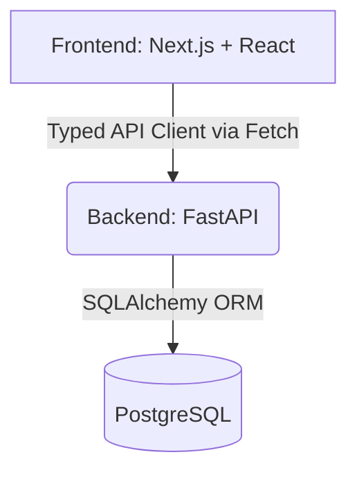

# FinLens 📊

**FinLens** is a premium, AI-powered consumer finance dashboard designed for robust transaction tracking, analytics, and reward redemption. Engineered with modern SaaS aesthetics, FinLens seamlessly processes massive datasets (10,000+ records) efficiently while providing a beautifully responsive, lightning-fast user experience.

---

## ✨ Key Features
- **Dashboard Overview:** Macro-level KPIs (Total Spend, Transaction Volume, Coin Balance, Active Categories) with real-time computation.
- **Dynamic Transaction Data Grid:** Advanced server-side pagination, multi-column sorting, and complex filtering (category, status, amount range, date range, and free-text search).
- **Interactive Analytics:** Visual breakdown of monthly trends and category spend, deep-linking directly into filtered transaction states.
- **Rewards Catalogue:** Atomic redemption of accumulated loyalty coins against available rewards, backed by strict race-condition safeguards.
- **Premium UI/UX:** Built with Tailwind V4, smooth Framer Motion animations, accessible modals/drawers, and beautiful typography (Inter & Playfair Display).

---

## 🏗 Architecture & Tech Stack

FinLens operates on a decoupled client-server architecture.

### **Tech Stack**
- **Frontend:** Next.js 15 (App Router), React 19, TailwindCSS V4, Framer Motion, Recharts.
- **Backend:** Python 3.9+, FastAPI, SQLAlchemy 2.0 (Async), Alembic, Pydantic.
- **Database:** PostgreSQL.
- **Tooling:** Pytest, TypeScript, ESLint.

### **Architecture Flow**


### Backend Structure
- **Models:** Strongly-typed SQLAlchemy 2.0 Declarative Base models (`User`, `Transaction`, `RewardCatalogue`, `Redemption`, `UserCoinBalance`).
- **Repositories:** Abstracted database access pattern ensuring clean segregation of querying logic.
- **Services:** Business logic layer handling data transformation, reward calculations, and atomic operations.
- **Routers (Endpoints):** Fast, async REST API endpoints documented automatically via OpenAPI.

---

## ⚙️ Core Technical Strategies

### **Filtering, Sorting, and Pagination**
All heavy lifting is executed **server-side** at the PostgreSQL database level using optimized SQL queries via SQLAlchemy.
- **Pagination:** Uses `LIMIT` and `OFFSET` based on `page` and `page_size`.
- **Sorting:** Dynamic column-based `ORDER BY` generation.
- **Filtering:** Constructing `WHERE` clauses dynamically (e.g., substring matching for search, numeric range filters for amounts).
- **Frontend Sync:** Filter state is strictly synced to the URL `searchParams`, allowing deep-linking and persistent back/forward browser navigation.

### **Analytics Aggregation**
Analytics endpoints (`/api/analytics/category` and `/api/analytics/monthly`) compute aggregations directly in the database using `GROUP BY` and `SUM()` clauses. This guarantees constant-time payload delivery to the frontend regardless of dataset size (e.g., 10,000 rows).

### **Atomic Reward Redemption**
Redeeming rewards is highly susceptible to concurrency bugs (double-spend). FinLens mitigates this by enforcing atomic transactions:
1. Validates reward existence and status.
2. Initiates a `SELECT FOR UPDATE` lock on the user's coin balance row.
3. Checks for sufficient balance.
4. Deducts coins, records the redemption log, and commits.
This completely eradicates race conditions when rapid subsequent requests are fired.

---

## 🚀 Setup Instructions

### 1. Database & Backend Setup
Ensure PostgreSQL is installed and running locally.

```bash
cd backend

# Create and activate virtual environment
python3 -m venv .venv
source .venv/bin/activate

# Install dependencies
pip install -r requirements.txt

# Environment Setup
cp .env.example .env
```
*Note: Update `.env` with your actual local PostgreSQL credentials.*

**Run Migrations & Seed Data:**
```bash
# Apply schema to DB
alembic upgrade head

# Seed 10,000 transactions and calculate balances
python scripts/seed.py
```

**Start the FastAPI Server:**
```bash
uvicorn app.main:app --reload
# API available at http://localhost:8000
```

### 2. Frontend Setup
```bash
cd frontend

# Install dependencies
npm install

# Environment Setup
cp .env.example .env.local

# Start Dev Server
npm run dev
# Frontend available at http://localhost:3000
```

---

## 🧪 Validation & Production Build

### **Run Backend Tests**
Execute the comprehensive Pytest suite:
```bash
cd backend
pytest
```
*Current Status: 100/100 passing.*

### **Frontend Production Build**
Verify TypeScript strictness and execute the Next.js production build:
```bash
cd frontend
npx tsc --noEmit
npm run build
```
*Current Status: 0 errors.*
